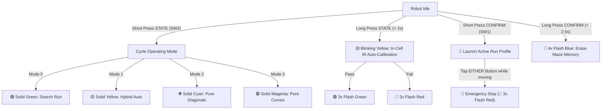

# 🐭 Antigravitieee Micromouse — Operator's Instruction Manual

This manual covers everything you need to build, flash, run, calibrate, and debug the **Antigravitieee** Micromouse robot completely wirelessly.

---

## 📑 Quick Navigation
1. [First-Time USB Setup](#1-first-time-setup-usb-cable-only-once)
2. [Wireless Firmware Flashing (Over-The-Air)](#2-wireless-firmware-flashing-over-the-air-ota)
3. [Mobile Phone Wireless Telemetry & Control (Bluetooth BLE)](#3-mobile-phone-telemetry--control-bluetooth-ble)
4. [Physical Buttons & RGB LED Field Guide](#4-physical-buttons--rgb-led-field-guide)
5. [Laptop Wireless Serial Monitor (Wi-Fi Telnet)](#5-laptop-wireless-serial-monitor-wi-fi-telnet)
6. [Git Version Control Cheat Sheet](#6-git-version-control-cheat-sheet)
7. [Pre-Flight Safety & Troubleshooting](#7-pre-flight-safety--troubleshooting)

---

## 1. First-Time Setup (USB Cable — Only Once)

Before using wireless flashing, the ESP32-S3 needs its initial bootloader and 8 MB partition layout flashed via USB-C:

1. Connect the ESP32-S3 DevKitC-1 to your computer using a USB-C data cable.
2. In PlatformIO terminal (or VS Code terminal), execute:
   ```powershell
   pio run -e esp32-s3-devkitc-1 -t upload
   ```
3. Open the serial monitor to verify bootup:
   ```powershell
   pio device monitor -b 115200
   ```
4. You should see:
   ```text
   ==================================================
     ANTIGRAVITIEEE MICROMOUSE - REVISION 1.0       
   ==================================================
   [INIT] Initializing SN74LVC125 PCNT Hardware Encoders...
   [INIT] Initializing Pololu Motoron M2T256 Motor Driver...
   [INIT] Initializing 5-Channel SFH4545/TEFT4300 IR System...
   [INIT] Initializing Bosch BNO055 IMU...
   [INIT] Starting Nordic UART Bluetooth Low Energy Service...
   [WIFI] Hotspot Started: SSID 'Antigrav-Mouse' | IP: 192.168.4.1
   [READY] Antigravitieee is Ready!
   ```
5. **Unplug the USB cable.** From this point forward, you never need the cable again!

---

## 2. Wireless Firmware Flashing (Over-The-Air / OTA)

Whenever you edit code, you can flash the robot over the air while it sits on the floor or in the maze.

### Method A: 1-Command PlatformIO Upload (Recommended)
1. Turn on the robot battery switch.
2. On your laptop, connect to the robot's Wi-Fi:
   * **SSID**: `Antigrav-Mouse`
   * **Password**: `micromouse`
3. Run:
   ```powershell
   pio run -e esp32s3_ota -t upload
   ```
4. PlatformIO compiles the code, transmits the binary wirelessly across Wi-Fi directly into the ESP32-S3 alternate flash partition (`ota_1`), checks MD5 verification, and reboots in ~8 seconds.

### Method B: Web Browser Upload (Phone or Laptop)
1. Connect your phone or laptop to `Antigrav-Mouse` Wi-Fi.
2. Open any web browser and go to:
   ```text
   http://192.168.4.1/update
   ```
3. Click **Choose File**, select `.pio\build\esp32-s3-devkitc-1\firmware.bin`, and click **Upload & Flash Firmware**.
4. The web page will show progress, flash the chip, and the robot will reboot.

---

## 3. Mobile Phone Telemetry & Control (Bluetooth BLE)

You can view real-time diagnostics and control the bot from your phone without touching it.

### Step 1: Install a BLE Terminal App
* **Android / iOS**: Install **Serial Bluetooth Terminal** (by Kai Morich) or **nRF Connect**.

### Step 2: Connect
1. Open Bluetooth on your phone and open **Serial Bluetooth Terminal**.
2. Go to **Devices** $\rightarrow$ **Bluetooth LE** $\rightarrow$ Scan.
3. Select **`Antigrav-Mouse`** and tap **Connect**.

### Step 3: Live Telemetry Stream
Once connected, the bot streams live sensor and motion data at 5 Hz:
```text
V:3.72V | Spd: 420 | Hdg:  90.0 | IR: 28, 45, 842, 856, 42, 31 | W:[.F.]
```
* `V`: Computer battery voltage (separate 1S cell; nominal 3.7V, fully charged 4.2V).
* `Spd`: Instantaneous linear velocity in mm/s.
* `Hdg`: Bosch BNO055 fusion heading in degrees ($0.0^\circ - 360.0^\circ$).
* `IR`: Readings for all 6 optical channels: `[L90, L45, FL, FR, R45, R90]`.
* `W`: Wall detection flags: `[L]` (Left), `[F]` (Front), `[R]` (Right). `.` indicates open corridor.

### Step 4: Wireless Console Commands
Type any of the following commands into the terminal:

| Command | Effect | LED Indication |
| :--- | :--- | :--- |
| `start` or `go` | Launches the selected run profile | Current profile color |
| `stop` or `estop` | **Emergency stop** — instantly brakes motors and aborts run | 🔴 3x Red Flash |
| `mode 0` or `search` | Selects **Search / Exploration** profile | 🟢 Solid Green |
| `mode 1` or `hybrid` | Selects **Speed Run: Hybrid Auto-Optimizer** (Curves + Diagonals) | 🟡 Solid Yellow |
| `mode 2` or `diag` | Selects **Speed Run: Pure Diagonal Specialist** | 🌐 Solid Cyan |
| `mode 3` or `curve` | Selects **Speed Run: Pure Continuous Curves** | 🟣 Solid Magenta |
| `motorcal` | Automated 3-point motor speed calibration and trim balancing | 🟡 Yellow $\rightarrow$ 🟢 Flash (Pass) / 🔴 Flash (Fail) |
| `motorrpm [duty]` | Runs tachometer benchmark at specified duty (default 50%) for 4s | 🌐 Solid Cyan |
| `motortrim [l r]` | Sets or queries motor trim multipliers saved in NVS | — |
| `enc` | Prints live raw encoder ticks, mm traveled, speed, and inversion status | — |
| `motorinv <l:0/1> <r:0/1>` | Sets motor direction inversion at runtime | — |
| `encinv <l:0/1> <r:0/1>` | Sets encoder count direction inversion at runtime | — |
| `calib` | Triggers in-cell IR optical calibration (200 samples) | 🟢 Flash Green (Pass) / 🔴 Flash Red (Fail) |
| `clear` | Erases mapped maze from Flash memory | 🔵 4x Blue Flash |
| `status` | Reports battery voltage, active mode, and navigation state | Current profile color |
| `perf` | Reports real-time 500Hz loop execution latency, peak time, overruns, and stack headroom | — |
| `help` | Lists available commands | — |

---

## 4. Physical Buttons & RGB LED Field Guide

If you are running the bot without a phone or laptop, use the two onboard pushbuttons and the RGB LED.

### Pushbutton Layout
* **SW1 (`CONFIRM`)** = GPIO 41
* **SW2 (`STATE`)** = GPIO 42
* **RGB LED** = Red: GPIO 39, Green: GPIO 38, Blue: GPIO 37 (Active-HIGH)



### Action Reference Table:
| Action | How to Trigger | Visual LED Indicator |
| :--- | :--- | :--- |
| **Cycle Modes** | Short press **`STATE`** (SW2) | Cycles 🟢 Green $\rightarrow$ 🟡 Yellow $\rightarrow$ 🌐 Cyan $\rightarrow$ 🟣 Magenta |
| **Launch Run** | Short press **`CONFIRM`** (SW1) | LED stays on active mode color |
| **In-Cell Calibration** | Long press **`STATE`** (> 2 sec) while in start cell | 🟡 Yellow during sampling $\rightarrow$ 🟢 3x Green on success |
| **Clear Maze Flash** | Long press **`CONFIRM`** (> 2.5 sec) | 🔵 4x Blue Flash (returns to active mode color) |
| **Emergency Stop** | **Tap EITHER button while robot is moving** | 🔴 3x Red Flash $\rightarrow$ Motors disabled |

---

## 5. Laptop Wireless Serial Monitor (Wi-Fi Telnet)

To view serial debug logs on your laptop without any USB wire:

1. Connect your laptop to `Antigrav-Mouse` Wi-Fi.
2. In your terminal, run:
   ```powershell
   pio device monitor --port socket://192.168.4.1:23
   ```
   *(Or using any telnet client: `telnet 192.168.4.1 23`)*
3. You will receive the exact same 115200 baud console stream and can send text commands directly.

---

## 6. Git Version Control Cheat Sheet

All modifications are recorded with clean commit history:

```powershell
# Check current branch and modified files:
git status

# View commit history:
git log --oneline

# Stage changes:
git add .

# Commit with a meaningful message:
git commit -m "feat: tuned turn PID and wall thresholds"

# (Optional) Push to your GitHub repository:
git remote add origin https://github.com/<your-username>/antigravitieee.git
git push -u origin master
```

---

## 7. Pre-Flight Safety & Troubleshooting

### Battery Safety Checklist
* **Computer Battery Chemistry**: Separate 1S Li-ion/LiPo cell (3.7V nominal); the schematic's 10k/10k divider feeds its voltage to GPIO12 (`VSenseCom`).
* **Low Battery Alert**: If the computer battery remains below **3.3V for 200 ms**, the robot automatically cuts motor power, engages emergency stop, and turns the LED **Solid Red**. Recharge immediately.
* The motor battery is a separate supply and is not monitored by this firmware cutoff. Check computer-battery voltage via BLE `status` or the telemetry stream.

### Sensor Calibration Check
Before a run in a new arena:
1. Place the robot in the starting cell centered between the walls.
2. Long-press `STATE` (> 2s) or send `calib` over Bluetooth.
3. Ensure you see **3x Green flashes** indicating baseline calibration is stored in Flash NVS.

### Emergency Stop Readiness
* Keep your phone open with **Serial Bluetooth Terminal** and the `stop` command typed in the input box, or keep your hand ready over either physical button on the robot. Tapping either button instantly brakes both motors.
